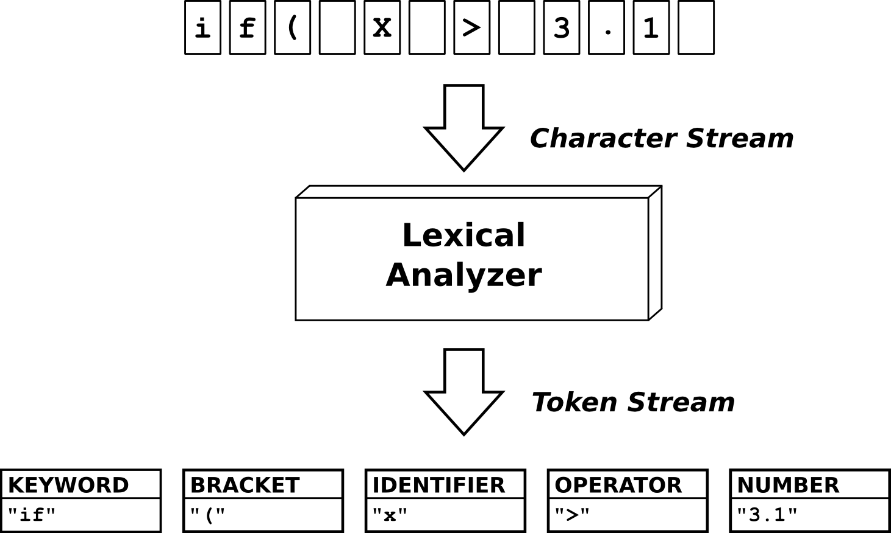
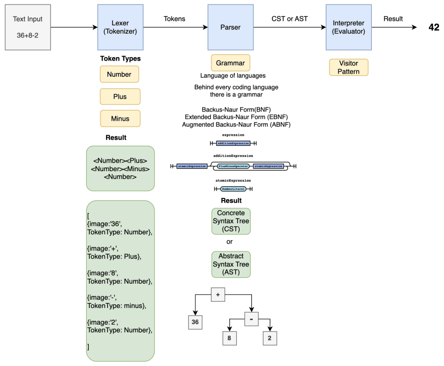

# **LangCraft**

- The main aim of this project is to create an interpreter for a custom programming language from scratch.

- It will involve defining the syntax of the language, implementing a lexer, developing a parser to construct an AST, and building a tree-walk interpreter to execute the code written in the custom language.

### What is an **INTERPRETER** ?
- An interpreter is a program that directly executes the instructions in a high-level language, without converting it into machine code.
- It does not generate any intermediate object code. Hence it is memory efficient.
------------
### What is the difference between an Interpreter and a Compiler ?
- A Compiler converts a high-level language to a low-level language whereas, an Interpreter translates code written in a high-level programming language into machine code line-by-line as the code runs. 

- Interpreters usually take less amount of time to analyze the source code. However, the overall execution time is comparatively slower than compilers.


## Table of contents 

- [About the Project](#about-the-project)
- [Implementation details of Interpreter](#implementation-details-of-an-interpreter)
  - [Scanning](#lexical-analysis)
  - [Parsing Expressions](#parsing)
  - [Abstract Syntax Tree](#tree-walk-interpreter)
  - [Language Reference](#language-reference)
  - [MakeFile](#makefile)
  - [Build](#build)
  
- [Contributors](#contributors)
- [Acknowledgements and Resources](#acknowledgements-and-resources)

-----
## About the Project
> Creating a custom Programming Language.

It involves the following stages : 
- Lexical Analysis (Lexing)
- Parsing (Syntax Analysis)
- Tree Walk Interpreter

## Implementation details of an Interpreter

##  **Lexical Analysis**
- Also known as tokenization, it converts a sequence of characters (string) to lexemes. 
- These lexemes pass through the lexer and it gives us tokens.
- These tokens are then sent forward to use in parsing. 

- These tokens are defined in [TokenType.h](https://github.com/siddhip2004/Lang-craft_eklavya23/blob/siddhi/chp9/TokenType.h).



### Significance of Lexical Analysis
The lexical analyzer is responsible for breaking these syntaxes into a series of tokens, by removing whitespace in the source code. If the lexical analyzer gets any invalid token, it generates an error. The stream of character is read by it and it seeks the legal tokens, and then the data is passed to the syntax analyzer, when it is asked for.


##  **Parsing**

- The tokens we get after lexing, are passed through the Parser.

- On receiving the tokens, it forms a [Parse Tree](https://en.wikipedia.org/wiki/Parse_tree  " parse tree ") using it.
- This parse tree is simplified, removing all the extra, syntactic stuff, to give the AST (Abstract Syntax tree).
- Thus, we can say, AST is a compact version of the parse tree.
- In parse tree, after getting rid of the extra comment or other syntactic stuff is present it is passed through AST.
>So the conversion of the tokens to AST is called Parsing.


- The Parser is defined in [Parser.h](https://github.com/siddhip2004/Lang-craft_eklavya23/blob/siddhi/chp9/parser.h).


## **Tree Walk Interpreter**
- After this step, we do semantic parsing whose result is an abstract syntax tree.

- AST is a tree data structure that stores various tokens as its nodes, such that it can abstractly represent the code in memory. 

>AST is what represents our language in memory, the program for generating an AST is given in  [GenerateAst.cpp](https://github.com/siddhip2004/Lang-craft_eklavya23/blob/siddhi/chp9/GenerateAst.cpp)
- The next step is to execute this syntax tree by recursively transversing it. 
> Here we implement the evaluation logic for each kind of expression that we can parse - [Interpreter.h](https://github.com/siddhip2004/Lang-craft_eklavya23/blob/siddhi/chp9/interpreter.h)



## Language Reference
Refer to this language reference - [CyPy](https://github.com/siddhip2004/Lang-craft_eklavya23/blob/nishat/Syntax.pdf)

## MakeFile
Here we will use MakeFile to run and compile our programs more efficiently. It defines set of tasks to be executed resulting in a final executable binary - [Makefile](https://github.com/siddhip2004/Lang-craft_eklavya23/blob/siddhi/chp9/Makefile)

----
## Build
```
git clone //
```
- Run **make** or **make jlox** to compile the program.

- Run **make generate_ast** to compile GenerateAst.cpp.

- Run **make ast_printer** to compile AstPrinterDriver.cpp.

- To enter interactive mode run **./cypy**

- Individual Tests (test-X.cypy) can be tested with **make test-X** and check the output with test-X.cypy.expected

- If you want to run all tests - **make test-all**

## Contributors

* [Nishat Patil](https://github.com/nishatp9)          
* [Siddhi Parekh](https://github.com/siddhip2004)


## Acknowledgements and Resources
* Thanks to [SRA-VJTI](https://sravjti.in/) for providing this wonderful opportunity in Eklavya 2023. 
* Special thanks to our mentor [Khushi Balia](https://github.com/khushi-Balia/), [Lakshaya Singhal](https://github.com/LakshayaSinghal) and Prit Kanadiya for their guidance throughout this project.
- [Crafting Interpreters](https://craftinginterpreters.com/)
- [How to use Markdown file](https://youtu.be/bpdvNwvEeSE)
- [Github Tutorial](https://youtu.be/uaeKhfhYE0U)
- [Flex and Bison Calculator](https://github.com/siddhip2004/Lang-craft_eklavya23/tree/nishat/Flex-Bison)
- [Notes](https://github.com/siddhip2004/Lang-craft_eklavya23/tree/siddhi/notes)
